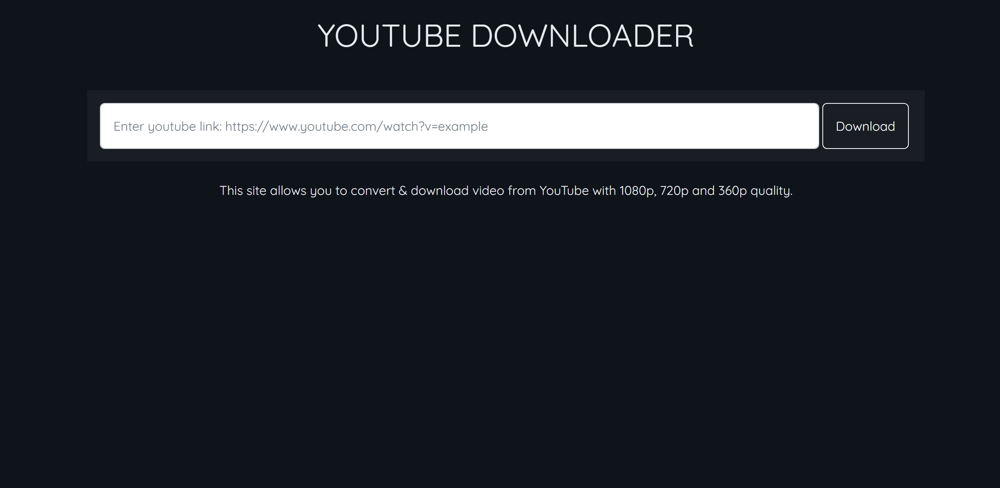
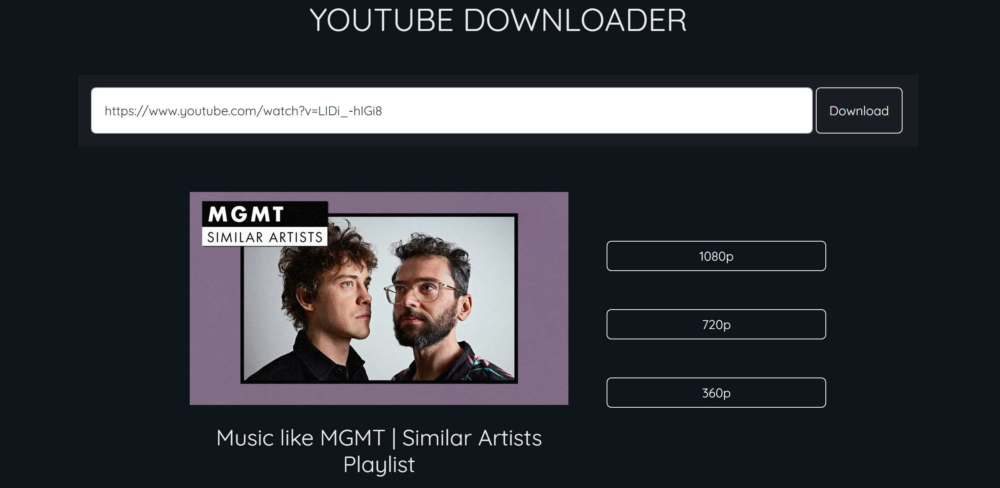

# Youtube Downloader

Convert & download video from YouTube with 1080p, 720p and 360p quality.

## Demo

## Dependencies

- [ytdl](https://www.npmjs.com/package/ytdl-core) - YouTube downloading module
- [expressJs](https://www.npmjs.com/package/express) - NodeJS framework

## Setup

After you cloned this repository:

- To run the front end
  - <code>cd client</code>
  - <code>npm start</code>
- To run the back end
  - <code>cd server</code>
  - <code>npm run dev</code>
